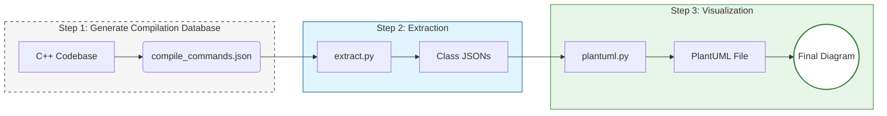

# From C++ to UML Class Diagram

## Overview
This project offers a pipeline for reverse-engineering C++ codebases. By leveraging Clang-based parsing, it extracts data structures and their relationships across multiple translation units to generate a comprehensive PlantUML Class Diagram.

## Workflow



### Step 1: Generate Compilation Database
Configure your CMake project to export compilation commands:
```bash
cmake -DCMAKE_EXPORT_COMPILE_COMMANDS=ON /path/to/source
```
*Note: Specific CMake commands are based on standard practices as the context focuses on the Python scripts.*

### Step 2: Extract Data Structures
Execute `extract.py` to parse source files and generate JSON representations of the classes.

```bash
python extract.py --input /path/to/compile_commands.json --output /path/to/output_dir [--namespace <prefix>]
```

**Arguments:**
* `--input`: Path to `compile_commands.json`.
* `--output`, `-o`: Path to the output directory (default: `output`).
* `--namespace`: Optional filter to to limit the scope of analysis.

### Step 3: Generate PlantUML Diagram
Execute `plantuml.py` to convert the extracted JSON files into a PlantUML Class Diagram.

```bash
python plantuml.py --input /path/to/output_dir --output /path/to/diagram.puml [--private]
```

**Arguments:**
* `--input`, `-i`: Path to the directory containing JSON files produced by `extract.py` (required) [3].
* `--output`, `-o`: Output `.puml` file path (default: `output/classes.puml`) [3].
* `--private`: Include private members in the diagram (default: public + protected only) [3].

## Prerequisites
* **Python 3** and **Clang Python Bindings**
  * Ensure `libclang` library and the corresponding Python bindings are compatible. The project was tested with [python clang 18.1.8](https://pypi.org/project/clang/18.1.8/) and `libclang-18.1.3`.
* **CMake**: Required to generate the `compile_commands.json` file.
* **Graphviz**: Used for rendering the generated `.puml` files (optional, for viewing).
* Recommendation
  ```
    sudo apt update
    sudo apt install clang libclang-dev graphviz

    cd <git repo directory>
    python -m venv .venv
    source .venv/bin/activate
    pip install clang
  ```

## Project Structure
* `ast_visitor.py`: Contains logic for traversing the Clang AST to extract data structures and their relationships.
* `extract.py`: Main entry point for parsing the compilation database and orchestrating the extraction process.
* `plantuml.py`: Generates the PlantUML script from the extracted JSON data.
